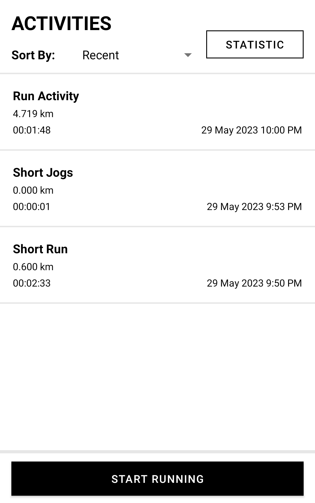
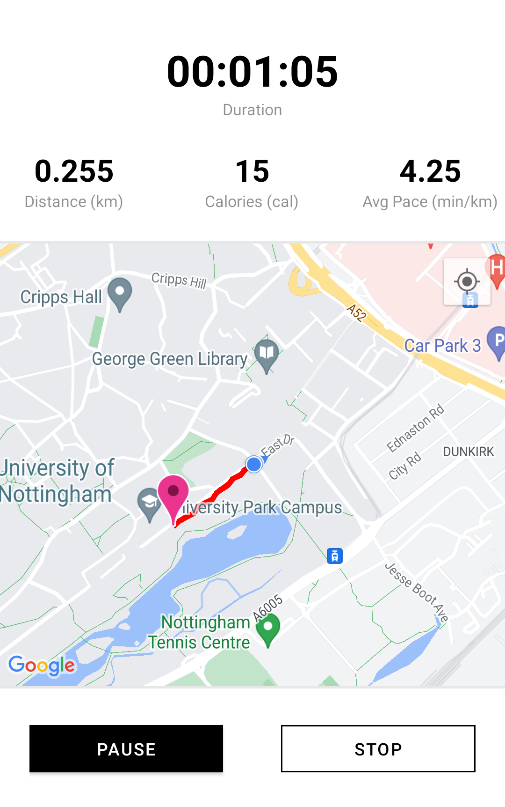
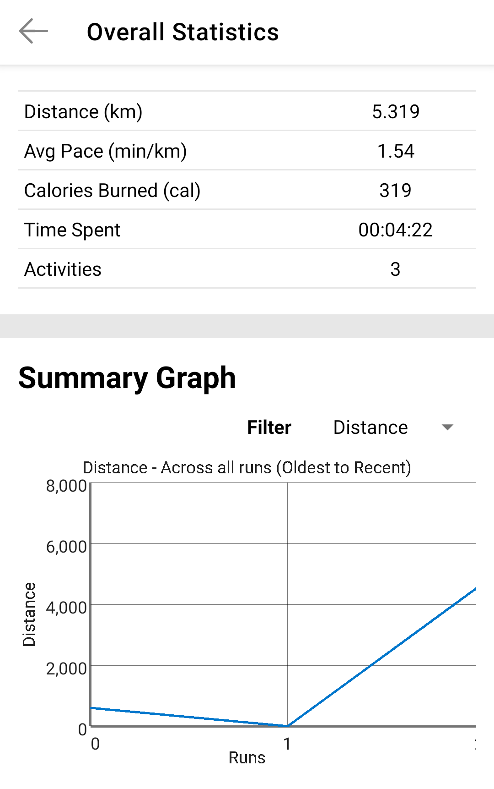
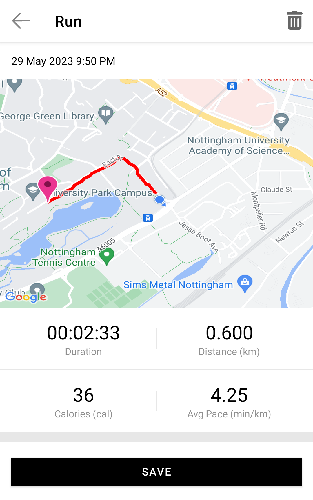
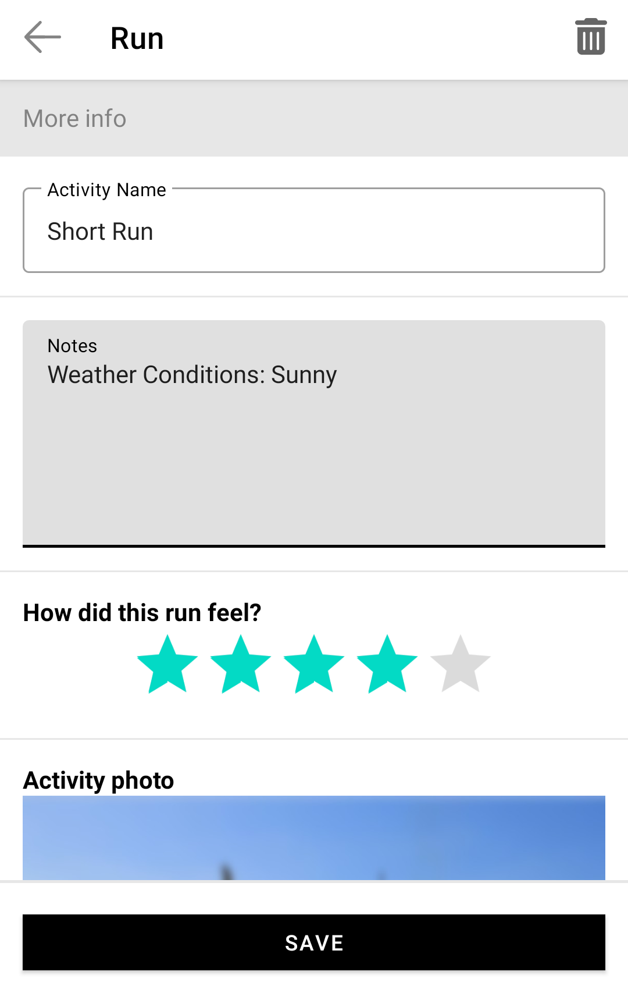

#   Running Tracker

A simple running tracker app design with Java to keep track of your Running records.

## Features

-   GPS tracking with maps and fitness stats monitoring
-   Run logs with sorting functionality
-   Profile fitness stats statistics
-   Run history customisation

## Installation

Get the apk from the [releases page](https://github.com/ShelbyChai/Running-Tracker/releases).

## Screenshots

|                   Running Logs                   |                    Run Activities                     |                       Profile Statistics                        |
| :----------------------------------------------: | :---------------------------------------------------: | :-------------------------------------------------------------: |
|  |  |  |

|                      Run History section 1                      |                      Run History section 2                      |                      Run History section 3                       |
| :-------------------------------------------------------------: | :-------------------------------------------------------------: | :--------------------------------------------------------------: |
|  |  |  |
